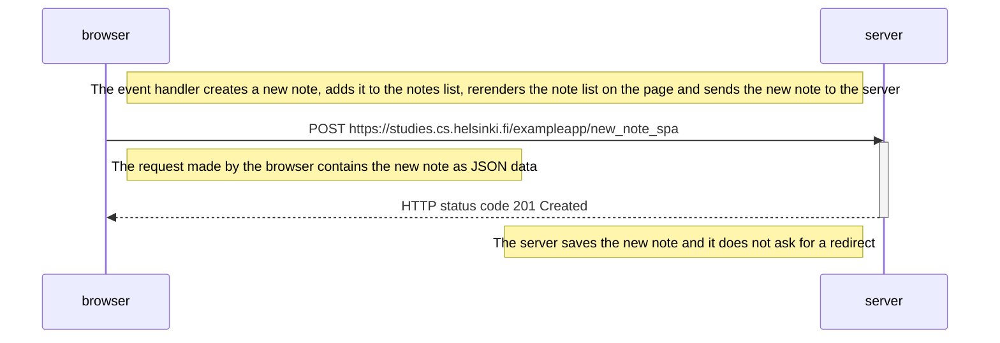

```mermaid
sequenceDiagram
participant browser
participant server

    Note right of browser: The event handler creates a new note, adds it to the notes list, rerenders the note list on the page and sends the new note to the server
    browser->>server: POST https://studies.cs.helsinki.fi/exampleapp/new_note_spa
    activate server
    Note right of browser: The request made by the browser contains the new note as JSON data
    server-->>browser: HTTP status code 201 Created
    deactivate server
    Note left of server: The server saves the new note and it does not ask for a redirect

```
